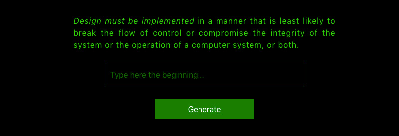

# Generator of new IT principles, patterns and anti-patterns

## How it works
Based on the text typed by an user, the neural network generate new software engineering principle.

## Implementation
A website was created with Flask.

## How it was done
More than a hundred IT principles, patterns, and anti-patterns were parsed from Wikipedia. Then the dataset was preprocessed to increase the efficiency of finetuned GPT-2 neural network.